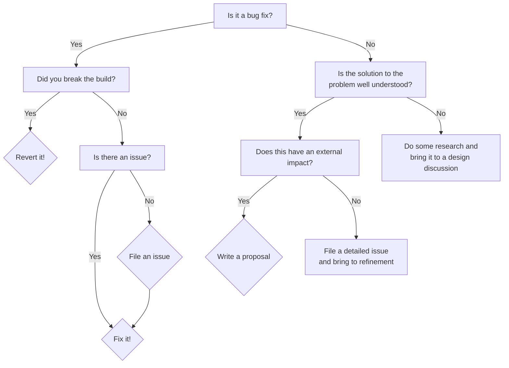

# HLSL Team Workflow

The HLSL team at Microsoft operates primiarly on open source codebases and has adopted the process described below for designing and making changes.

## Types of Documentation

Producing documentation is as integral to the HLSL team's development process as producing code. There are several types of documentation that the team produces:

* Technical Strategy Document (TSD)
* Proposal
* Specification
* Issue
* Implementation Documentation
* User Documentation

### Technical Strategy Document

TSDs are internal documentation produced by the team at Microsoft to communicate high level direction and decisions that have cross-functional impact. These documents themselves are generally not shared publicly and are not relevant to open-source contributors.

### Proposal

The HLSL team uses a proposal process for designing language and shader model features as well as large or complicated infrastructure features. The proposal process is the primary use of the [hlsl-specs](https://github.com/microsoft/hlsl-specs) repository.

### Specification

A full language specifiction for HLSL is being [drafted](https://github.com/microsoft/hlsl-specs/tree/main/specs/language). Each new language and shader model feature following the proposal process will develop a full **Detailed Design** which serves as a standalone feature specification until it can be integrated into the language or interchange format specification.

### Issue

The primary documentation required for each task or bug being worked on is a _GitHub Issue_. Each GitHub Issue is expected to contain a description of the work to be performed and an _Acceptance Criteria_ to mark the succcessful completion of the issue. Some larger tasks can be tracked with _metabug_ issues that have sub-tasks tracked in separate issues.

### Implementation Documentation

All significant systems built in the HLSL compiler should have accompanying implementation documentation. For problems where the problem space is well understood and the broad strokes of the implementation are clear implementation documentation may be used as documentation of a plan rather than an infrastructure proposal.

### User Documentation

All parts of the HLSL language and compiler with user exposure should have user documentation. We realize this is not the state today, but it is something we are striving for. When adding new features or revisiting old features we will update and supplement existing documentation wherever possible.

## GitHub Projects

The HLSL team process is coordinated with GitHub Projects. We operate primarily using 3 GitHub projects:
* [HLSL in LLVM](https://github.com/orgs/llvm/projects/4/views/3)
* [DXC Roadmap](https://github.com/orgs/microsoft/projects/884)
* [DXC Triage](https://github.com/orgs/microsoft/projects/891)

## Process Flowchart

You are tasked with making a change. What documentation do you write?

### External Impacting Changes

Examples of external impact:
* Is this a change to the language or DXIL?
* Does this change the public API of our DLLs or the behavior of public APIs?
* Is this a behavior difference from DXC and/or FXC?

### Issue Refinement (LLVM)

The HLSL team meets weekly to refine issues by updating descriptions, assigning priority and rough issue sizing. Issue refinement is driven through [this GitHub project view](https://github.com/orgs/llvm/projects/4/views/13). External contributors can attend this meeting by request.

### Issue Triage (DXC)

While most of the HLSL team's focus has shifted to LLVM & Clang, we do continue to triage new issues in DXC daily using the [triage project](https://github.com/orgs/microsoft/projects/891/views/1).

DXC triage is focused on identifying critical issues that need to be resolved in upcoming DXC releases and placing them in the appropriate milestone. Most new issues in DXC are being placed in the [Dormant milestone](https://github.com/microsoft/DirectXShaderCompiler/milestone/11), which tracks known issues that the HLSL team is not planning to address in DXC but we will support/fix/avoid in Clang.

### Design Discussion

The HLSL team has weekly design meetings to discuss designs. These meetings can be open to external contributors. The HLSL design meetings are regularly used at every step in the design process for a project.

The individual bringing a topic to a design discussion will be the discussion leader for the meeting. The discussion leader should have a clear question they want to answer in the meeting. Near the conclusion of a design discussion the discussion leader should produce a list of action items they (or others) are going to pursue.

#### Discussion Preparation

Early in the process we expect the discussion leader to prepare for the discussion. This preparation could be doing background research, producing a pre-read document, a rough draft proposal or a slide presentation.

Some guiding questions to answer before a design meeting include:
* Does it change an external interface (DXIL, API, Language)?
* What are we trying to solve?
* Current behaviors (FXC, DXC & Clang)
* Historical context (why is this a problem, how has it been solved or not)
* Is there prior art or some solution to a similar problem? (FXC, DXC, Clang, LLVM, Slang, Metal, ML,... ?)
* Who are the users and what is the impact on them?
